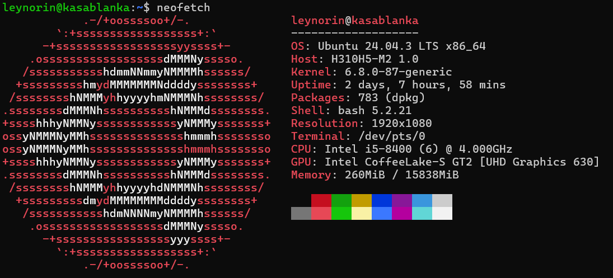

# Как настроить свой VPN-сервер для доступа к отечественным сервисам из-за границы?
## VPN - что такое?

**VPN - виртуальная приватная сеть (virtual private network)**.  

Для чего это вообще нужно? Пример: вы решили отдохнуть заграницей (Китай) летом. Вы самозанятый. Вдруг, настало 9 число месяца (день оплаты налогов самозанятым), но вы не можете оплатить налог, т.к. не имеете доступа к ЕГР ФНС. В этом случае пригодится доступ к своему собственному VPN.
## Подготовка

Будем считать, что у Вас дома есть home lab (дословно домашняя лаборатория/сервер). Тогда подготовка к конфигурации VPN займет немного времени. Поставим на home lab `Ubuntu Server LTS` (LTS - long term support).

## Выбор софта для развертывания

Наиболее популярные решения для развёртывания собственного VPN:

- OpenVPN — классический, надёжный, гибкий.
- WireGuard — современный, простой в конфигурации, высокопроизводительный.
- SoftEther VPN — многофункциональный, поддерживает множество протоколов.

Основываясь на наших потребностях, мы выбрали `WireGuard` (Далее Wireguard = wg).
## Установка WireGuard и ufw

Для начала обновим списки пакетов, а далее обновим систему:
```bash
sudo apt update && sudo apt upgrade -y
```

Далее установим wireguard и ufw
```bash
sudo apt install wireguard ufw
```

- ufw - удобное управление файрволлом системы (менеджер файрволла)
## Генерация ключей для wg

WireGuard использует пары приватный/публичный ключ.
Ключи обеспечивают:
- Шифрование трафика
- Аутентификацию сторон без логинов/паролей
- Защиту от подмены (каждый пакет подписан)
```bash
wg genkey | tee /etc/wireguard/server_private.key | wg pubkey > /etc/wireguard/server_public.key
```

## Настройка конфига для wg

Файл `/etc/wireguard/wg0.conf`:
```bash
[Interface]
Address = 10.0.0.1/24
PrivateKey = <PRIVATE_KEY>
ListenPort = 51820


PostUp = iptables -A FORWARD -i wg0 -j ACCEPT
PostUp = iptables -t nat -A POSTROUTING -o eth0 -j MASQUERADE
PostDown = iptables -D FORWARD -i wg0 -j ACCEPT
PostDown = iptables -t nat -D POSTROUTING -o eth0 -j MASQUERADE


[Peer]
PublicKey = <CLIENT_PUBLIC_KEY>
AllowedIPs = 10.0.0.2/32
```

- Блок `[Interface]`
    * Address - чисто настройка внутренней VPN сети
    * PrivateKey - приватный ключ, который мы создали на прошлом шаге
    * ListenPort - порт, к которому клиент сможет обращаться для доступа к VPN
    * PostUp - команда перед запуском интерфейса wg0 (первая строка - доступ к Интернету с сервера, вторая - подмена ip клиента на ip сервера)
    * PostDown - команда после выключения интерфейса wg0 (первая строка - выключает доступ к Интернету с сервера, вторая - выключает подмену ip клиента на ip сервера), откат изменений
- Блок `[Peer]` - клиент
    * PublicKey - публичный ключ клиента
    * AllowedIPs - разрешает доступ клиента к ip 10.0.0.2/32 в подсети VPN.

## Включение IP-маршрутизации

В файле `/etc/sysctl.conf` раскомментируем:
```bash
net.ipv4.ip_forward=1
```

Применяем изменения:
```bash
sudo sysctl -p
```

## Запускаем wg как демон

```bash
sudo systemctl enable wg-quick@wg0
sudo systemctl start wg-quick@wg0
```

## Настройка клиента (peer)

Файл `client.conf`:
```bash
[Interface]
PrivateKey = <CLIENT_PRIVATE_KEY>
Address = 10.0.0.2/32
DNS = 1.1.1.1


[Peer]
PublicKey = <SERVER_PUBLIC_KEY>
Endpoint = <SERVER_IP>:51820
AllowedIPs = 0.0.0.0/0
PersistentKeepalive = 25
```

Тут из интересного только AllowedIPs - это значит, что ВЕСЬ ipv4 трафик будет идти через VPN. (0.0.0.0/0 = ipv4 трафик)  
Файл нужно импортировать в приложение WireGuard.

## Проверка

Все! Теперь просто импортируем файл client.conf на телефон в приложении WireGuard. Теперь у нас есть доступ к Российским сервисам! 

## Ссылки/ресурсы

- Официальная документация [WireGuard](https://www.wireguard.com)
- Инструкция с [tech2geek](https://www.tech2geek.net/how-to-set-up-a-wireguard-vpn-on-linux-step-by-step-guide/)
- Инструкция с [Ubuntu Docs](https://documentation.ubuntu.com/server/how-to/wireguard-vpn/on-an-internal-system/)